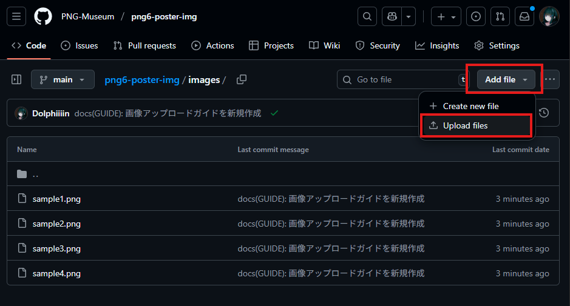
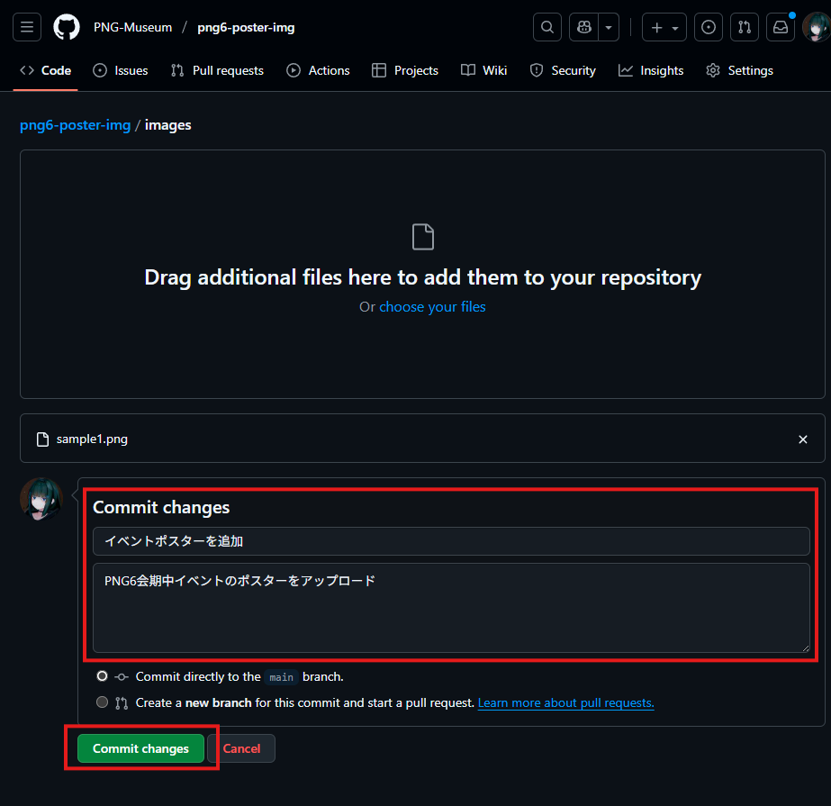
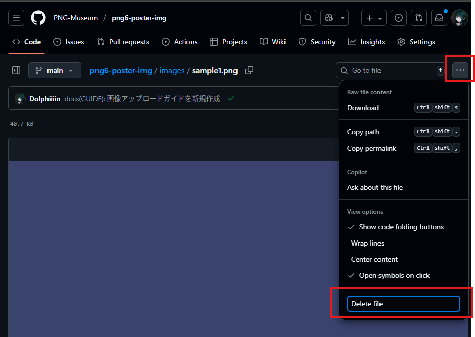
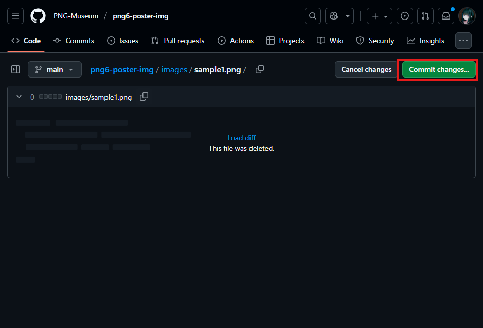
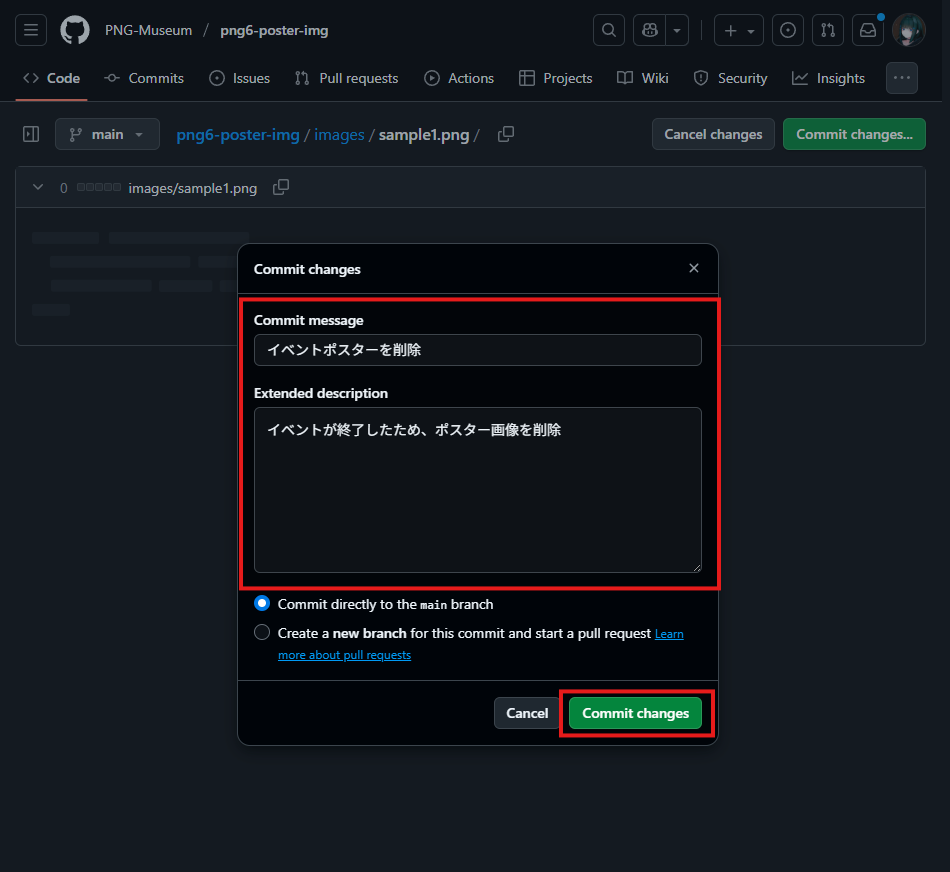

# 🐊 ワニでもわかる画像アップロードガイド

## 🎯 画像をアップロードする手順

### ステップ1: imagesフォルダーを見つける

1. 以下のリンクからリポジトリにアクセスします
   https://github.com/PNG-Museum/png6-poster-img/tree/main/images


### ステップ2: 画像をアップロードする

1. `images` フォルダー内で **「Add file」** ボタンをクリックします
2. ドロップダウンメニューから **「Upload files」** を選択します


3. 以下のいずれかの方法で画像を追加できます：
   - **ドラッグ&ドロップ**: 画像ファイルを画面の指定エリアにドラッグします
   - **ファイル選択**: **「choose your files」** をクリックして画像を選択します

### ステップ3: アップロードを完了する

1. 画像が正しく選択されていることを確認します
2. 画面下部の **「Commit changes」** ボタンをクリックします
3. 必要に応じてコメント欄に「画像を追加しました」などのメッセージを入力します
4. **「Commit changes」** をもう一度クリックして完了です



## 🗑️ 画像を削除する手順

### ステップ1: 削除したい画像を見つける

1. `images` フォルダー内で削除したい画像ファイルをクリックします
2. 画像のプレビューページが表示されます

### ステップ2: 削除を実行する

1. 画面右上の三点リーダー（…）をクリックします
2. ** 「Delete file」 ** を選択します
   
3. **　「Commit changes」** ボタンをクリックします
   
4. 必要に応じてコメント欄に「画像を削除しました」などのメッセージを入力します
5. **「Commit changes」** ボタンをクリックして削除完了です
   


## 📏 画像に関する制限とルール

### アップロード可能な画像

- **ファイル形式**: PNG、JPG、JPEG
- **枚数制限**: 最大4枚まで (フォルダー内に画像が4枚以上ある場合は、古い画像を削除してください)
- **ファイルサイズ**: 1枚あたり25MB以下（推奨は5MB以下）

### 推奨される画像サイズ

- **アスペクト比**: 特に制限はありませんが、9:16（縦長）が理想的です
- **解像度**: 1080×1920ピクセル以上を推奨

## ⚡ 自動処理について

画像をアップロードすると、以下の処理が自動で実行されます：

1. **自動アトラス化**: 約2〜5分で4枚の画像が1枚にまとめられます
2. **ウェブサイト更新**: 処理完了後、画像URLが利用可能になります
3. **VRChat対応**: VRChatのImage Loading機能で使用できるようになります

### 処理状況の確認方法

1. リポジトリのトップページで **「Actions」** タブをクリックします
2. 最新の処理状況が表示されます
3. ✅ 緑色のチェックマークが表示されれば処理完了です
4. ⏳ オレンジ色の丸は処理中を示します

## 🔗 画像URLの確認方法

処理が完了すると、以下のURLで画像にアクセスできます：

```
https://png-museum.github.io/png6-poster-img/packed-images.png
```
